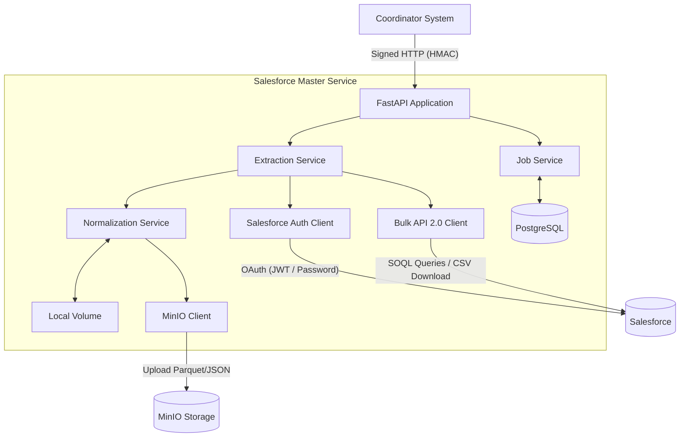
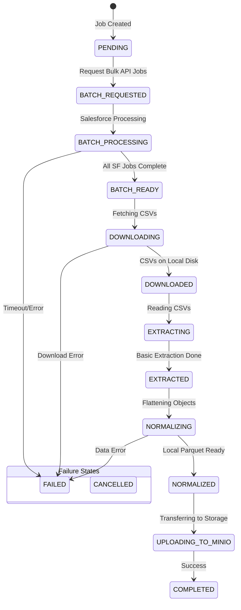

# Salesforce Master Service Architecture

## 1. High-Level Architecture

The Salesforce Master Service is an isolated microservice that extracts data from Salesforce, normalizes it, and publishes it to object storage. It is controlled by an external "Coordinator" via a signed REST API.

## 2. Core Components

*   **FastAPI Application:** Serves as the entry point. Exposes REST endpoints for starting, canceling, resuming, and monitoring data extraction jobs.
*   **PostgreSQL Database:** The source of truth for job state. Tracks the progress of each run across its lifecycle, allowing for recovery and resumption if the service crashes. Also stores audit logs and dead-letter queue records.
*   **MinIO (Object Storage):** The destination for the final, cleaned data. Files are uploaded here in Parquet (or JSON) format, partitioned by organization and processing date.
*   **Local Storage:** Temporary scratch space used during a run to store downloaded CSVs from Salesforce before they are normalized and uploaded.

## 3. Job Lifecycle & State Machine

A single extraction run ("Job") progresses through a strict state machine.

*Note: In-progress states (BATCH_PROCESSING, DOWNLOADING, EXTRACTING, NORMALIZING, UPLOADING_TO_MINIO) periodically update a heartbeat. If the heartbeat goes stale, a background process can mark the job as FAILED.*

## 4. Key Internal Services

*   **JobService:** Manages database interactions for the `Job` entity. Updates statuses, records timestamps, and handles crash detection via heartbeats.
*   **ExtractionService:** The top-level orchestrator for a job. It launches the background workflow (submit -> poll -> download -> extract) and handles resume/cancel logic.
*   **SalesforceAuthClient:** Handles authentication with Salesforce using OAuth 2.0 (JWT Bearer or Username-Password flows) and manages token caching.
*   **SalesforceBatchAPIClient:** Interfaces with Salesforce Bulk API 2.0 to create SOQL query jobs, poll their status, and download the resulting CSV files.
*   **BatchPollingService:** Manages the polling loops for Salesforce jobs.
*   **NormalizationService:** Orchestrates the transformation of raw Salesforce CSVs into clean relational tables. It routes data to specific normalizers (e.g., `AccountNormalizer`, `ContactNormalizer`).
*   **MinIOClient:** Handles uploading the normalized data to the configured MinIO bucket.

## 5. Security & Authentication

*   **HMAC Authentication:** All protected endpoints require an HMAC-SHA256 signature from the calling Coordinator.
    *   Requests must include `X-SF-Signature`, `X-SF-Timestamp`, `X-SF-Client-ID`, and `X-SF-Nonce`.
    *   Provides protection against replay attacks (via nonce/timestamp) and ensures payload integrity.
*   **Ephemeral Credentials:** Salesforce login credentials provided in the `start_scan` request are never persisted to the database. They are used immediately to obtain an access token and then discarded.
*   **Audit Logging:** All critical actions (starts, stops, auth failures) are logged to the `audit_logs` table.

## 6. Resilience & Reliability

*   **Retry Mechanism:** All external calls (Salesforce API, MinIO) are wrapped in a resilient retry loop (with exponential backoff and jitter) to handle transient failures like timeouts, 429 Too Many Requests, or 503 Service Unavailable.
*   **Dead-Letter Queue (DLQ):** If an external call exhausts all its retries, the failure is recorded in the `failed_external_calls` table. The payload is scrubbed of sensitive information before being saved, allowing engineers to investigate the failure later.
*   **Crash Recovery:** Because job state is granularly tracked in PostgreSQL, if the FastAPI container crashes and restarts, jobs in a `FAILED` state (due to heartbeat timeout) can be manually or automatically resumed from their last completed stage (e.g., skipping download if the files are already on disk).
